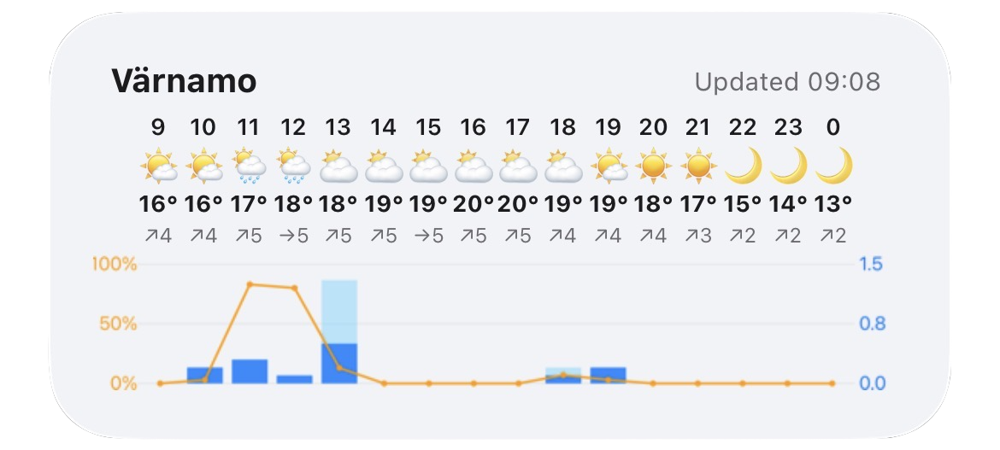
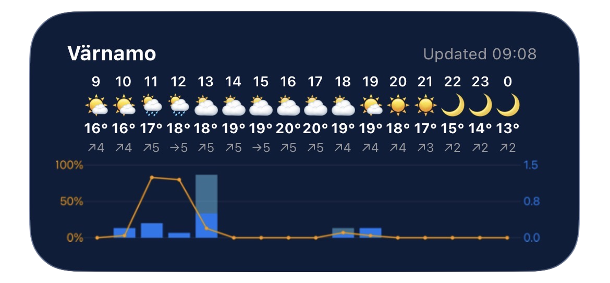
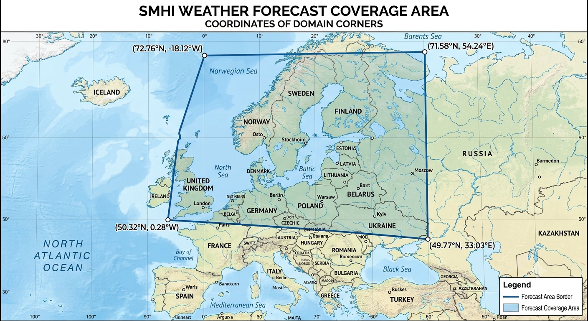

# 🌤️ SMHI Weather Forecast iPhone Widget

An iPhone medium-sized widget for [Scriptable](https://scriptable.app) that displays a clean, detailed 16-hour weather forecast using data from the Swedish Meteorological and Hydrological Institute ([SMHI](https://www.smhi.se/)).

  
  

## ✨ Features

- **SMHI Open Data API:** Highly accurate forecasts for Sweden and the surrounding northern European region (see image below).
- **16-Hour Hourly Breakdown:** View hourly temperature, wind speed, wind direction, and weather symbols at a glance.
- **Precipitation & Probability Chart:** Combined visual chart displaying:
  - **Orange Curve:** Probability of precipitation (`%`).
  - **Blue Bars:** Min/Max expected precipitation (`mm`).
- **GPS & Custom City Support:** Automatically detects your location via GPS, or allows you to specify a fixed city name via a widget parameter.
- **Offline Caching:** Saves the latest successful forecast and location data locally so your widget never appears broken during network drops.
- **Dynamic Themes:** Seamlessly adapts to iOS light mode and dark mode.
- **Interactive:** Tap the widget to open the full SMHI weather forecast in your browser.

<figure align="center">
  
  <figcaption><i>Approximate area for which forecasts from SMHI are available.</i></figcaption>
</figure>

## 📲 Step-by-Step Installation

### Step 1: Install Scriptable

1. Download **[Scriptable](https://apps.apple.com/us/app/scriptable/id1405459188)** from the iOS App Store.
2. Open the app at least once to initialize it.

### Step 2: Add the Script

1. Open [smhi-weather-widget.js](smhi-weather-widget.js) in this repository and tap **Raw** (or copy the code directly).
2. Open the **Scriptable** app on your iPhone or iPad.
3. Tap the **`+`** icon in the top right corner to create a new script.
4. Paste the copied JavaScript code into the editor.
5. Tap the title at the top, name it **`SMHI Weather`**, and tap **Done**.

### Step 3: Add the Widget to Your Home Screen

1. Long-press an empty area on your iPhone Home Screen until your apps jiggle.
2. Tap **Edit** in the top-left corner, and then **Add widget**.
3. Search for **Scriptable** and select the **Medium** widget size.
4. Tap **Add Widget** to place it on your Home Screen.

### Step 4: Configure the Widget

1. Long-press the newly placed Scriptable widget and select **Edit Widget**.
2. **Script:** Choose **`SMHI Weather`**.
3. **When Interacting:** Set to **Run Script** (the widget opens SMHI's forecast page when tapped).
4. **Parameter (Optional):**
   - **Leave blank** to use your automatic **GPS location** (requires granting Location permissions to Scriptable).
   - **Enter a city name** (e.g., `Stockholm`, `Gothenburg`, `Kiruna`) to lock the forecast to a specific city.

## ⚙️ Configuration & Parameter Mode

You can control how the widget resolves its location without modifying the script:

| Mode                   | Parameter Value | Behavior                                                                 |
| :--------------------- | :-------------- | :----------------------------------------------------------------------- |
| **GPS Mode (Default)** | _(Leave Blank)_ | Uses your device GPS and reverse-geocodes your current town/city.        |
| **Fixed City Mode**    | `Stockholm`     | Uses Open-Meteo geocoding to look up coordinates for the specified city. |

## 🛠️ Troubleshooting

- **"GPS failed & no cached location":** Ensure Scriptable has Location Services enabled under **iOS Settings → Privacy & Security → Location Services → Scriptable** (set to _While Using the App_ or _Always_).
- **"City not found":** Verify the spelling of the city name in the widget parameter. Make sure that the city is within the coverage area of the SMHI forecast (see image under **Features**).
- **Chart or icons look squished:** This script is designed specifically for the **Medium** iPhone widget size. Ensure you selected the Medium format when adding the widget to your Home Screen.

## 📄 License

This project is open-source and available under the [MIT License](LICENSE). Meteorological forecast data come from [SNOW (Swedish National Operational Weather forecast)](https://www.smhi.se/data/sok-oppna-data-i-utforskaren/meteorologisk-prognos-api), provided by SMHI.
